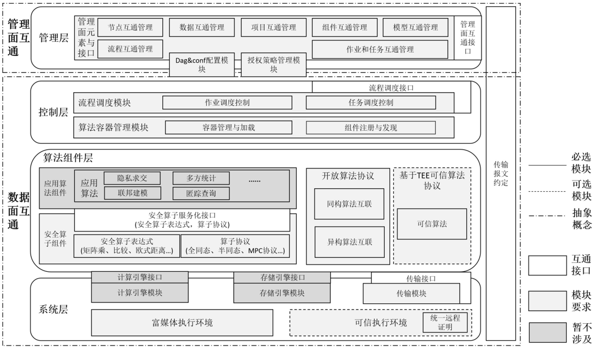

# 异构TEE互联互通

本仓库用于展示北京金融科技产业联盟（Beijing FinTech Industry Alliance）数据专委会隐私计算互联互通课题组中TEE互联互通子课题研究成果，成果归属金科联盟数据专委会。

成果形式包括各类文档和参考代码等，其中：

 - 文档默认推荐使用 Markdown格式
 - Restful 接口推荐使用 swagger 工具导出
 - RPC 接口推荐使用 protobuf 文档描述
 - 函数接口描述要求添加函数的功能、入参、出参等详细的注释


## 隐私计算整体互联互通架构

<div align="center">
    
</div>

## TEE互联互通子课题研究内容

[其中TEE互联部分详见Interconnection-TEE.md](Interconnection-TEE.md)


## 仓库提交流程

请各课题研究单位发起 Pull Request（PR），PR 经过课题组及社区审核后，合入主干分支。

发起 Pull Request 的流程：

1. Fork 本仓库到您的个人目录下
2. 将成果文件添加到您的个人仓库。关于如何将文件添加到 git 仓库请参考 [git 基本操作教程](https://git-scm.com/book/zh/v2/Git-%E5%9F%BA%E7%A1%80-%E8%8E%B7%E5%8F%96-Git-%E4%BB%93%E5%BA%93)
3. 在您的个人仓库的"Pull Requests"页面发起一个 PR，合入的目标为 jinzhao-dev/interconnection-bfia-tee 的 main 分支。关于 Github PR 创建流程的更详细步骤参考 [Github 官方文档](https://docs.github.com/en/pull-requests/collaborating-with-pull-requests/proposing-changes-to-your-work-with-pull-requests/creating-a-pull-request-from-a-fork)
4. 课题组及社区 Review PR，如果 PR 需要修改，发起单位需将更新内容 push 到个人仓库，PR 页面会自动更新
5. PR 通过以后，合并入本仓库


## 仓库组织形式

```
interconnection-bfia-tee
├── LICENSE
├── README.md
|── Interconnection-TEE.md  # TEE互联互通子课题研究内容
|── reports  # 统一远程证明格式报告参考示例目录
└── swagger  # RESTful接口文档目录
```

